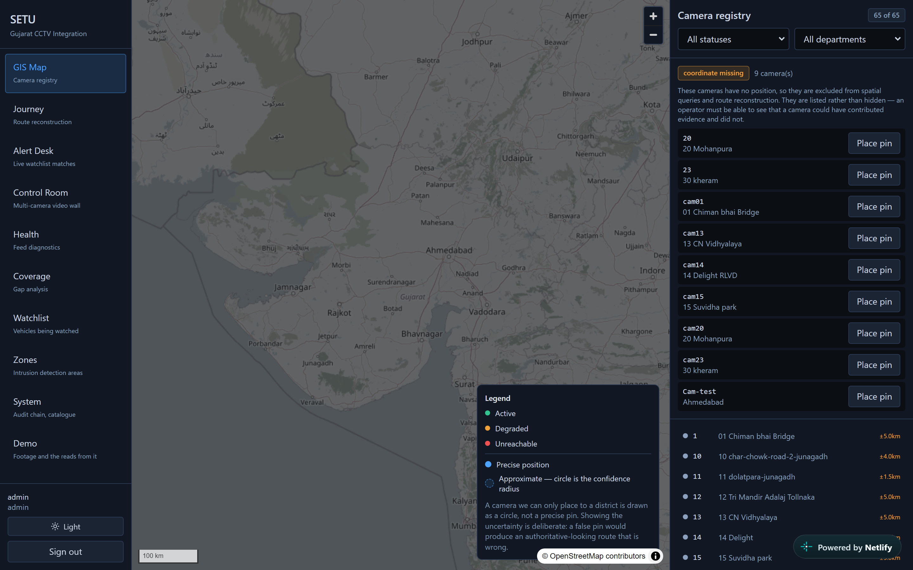
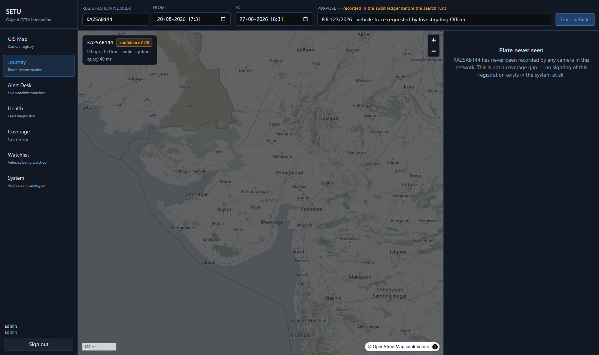
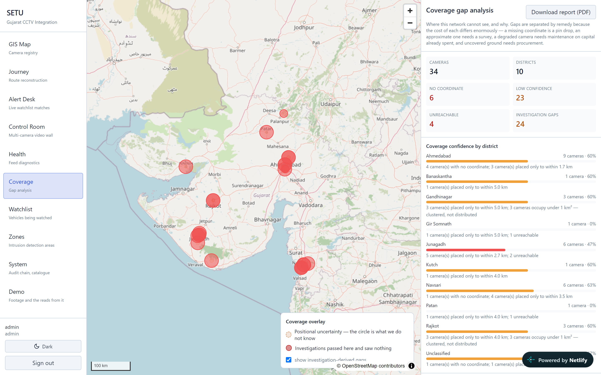
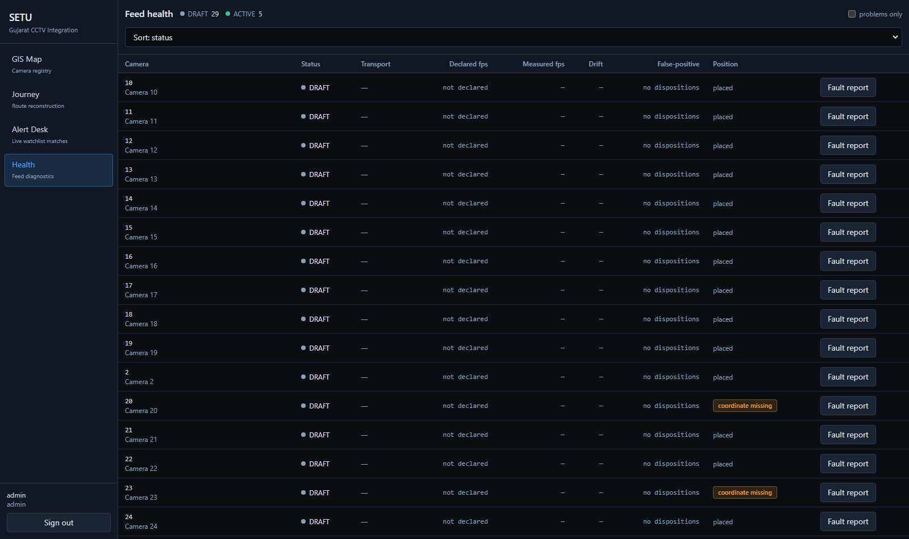

# Project SETU

Gujarat Police operate roughly 80,000 CCTV cameras across 26 government departments
that cannot interoperate — different vendors, VMS platforms, storage and retention.
SETU is one web platform that federates them, so that **a judge can supply a vehicle
registration number and see that vehicle's route across the camera network on a map,
with timestamps, evidence photographs, and honest gaps where we did not see it.**
Separately, a watchlisted vehicle appearing on a live feed raises an alert within
seconds.

Built for the Gujarat Police Innovation Challenge 2026 (CCTV Integration Hackathon),
Category 1.

---

## Solution model

**Hybrid**: Model 1 (centralised registry and GIS — mandatory) + Model 3 (federation
middleware — the structural core) + Model 2 (unified viewing — the operator surface),
with Model 4 documented as a migration path rather than a starting position.

Gujarat does not have a camera problem; it has 26 camera *ecosystems* with different
ages, owners and AMC periods. Any architecture that begins by replacing them is
unaffordable. Any architecture that connects directly to each creates an N-to-N
integration burden that grows with every AMC renewal. So Model 1 is not a spreadsheet
with a map — it is the control plane. Every camera carries one identity record: who
owns it, where it is, what it can do, and what the platform is currently allowed to
pull from it. Model 3's adapter layer is how that control plane reaches heterogeneous
reality: one interface, many implementations. Model 4's analytics and evidence
requirements are adopted; its assumption that all video must flow to one datacentre is
deliberately dropped. **Video stays at the edge; metadata flows to the centre.**

---

## Measured results

Everything below was produced by running the system. Nothing is estimated.

### Feed-contract compliance — 8/8

The organiser's §2.4 pre-submission checklist, verified empirically against the live
gateway, not asserted from code comments. `reports/evidence/preflight-*.json`.

### Performance

| Measurement | Result | HLD claim | Verdict |
|---|---:|---|---|
| Journey query, 12-hour window | median **38 ms**, p95 **60 ms** | under 3 s | meets |
| Decode to alert | median **14 ms**, p95 **1486 ms** | under 2 s | meets |
| Motion gate pass rate | **13.7%** | — | 86% of frames never reach the detector |

### Throughput and the 80,000-camera question

| Case | Resolution | Decode | Cameras/worker | Workers for 80,000 |
|---|---|---:|---:|---:|
| Full resolution, as published | 2560×1440 | 24.3 fps | 0.81 | ~98,500 |
| Sub-stream, as ANPR ingests | 704×396 | 114.4 fps | 3.82 | **~21,000** |

Both figures are **CPU-only, no GPU**. Read them together with the accuracy caveat
below: the recogniser reads **nothing** at 704×396, so the 3.82 figure is throughput
at an unusable operating point. The defensible number is the full-resolution one —
**~98,500 CPU workers for a centralised design**, which is a stronger argument for
pushing analytics to the edge and moving metadata rather than video, not a weaker one.
Finding the lowest resolution that preserves plate legibility is the single most
valuable optimisation outstanding. See `reports/evidence/benchmarks-*.md` and
[`docs/HLD_RECONCILIATION.md`](docs/HLD_RECONCILIATION.md).

### The government feed — the scored test case

The estate was swept twice with the same pipeline, running against `GatewaySource`
instead of a file. `reports/evidence/gateway-output-report-2026-08-27.md`.

| | Result |
|---|---:|
| Cameras catalogued | 30 |
| Cameras that produced frames | **25** |
| Cameras that produced none | 5 — two return HTTP 500, three time out |
| Frames decoded | 9,158 |
| Plate regions detected | 30 |
| Grammar-valid registrations | **2** |

**Nine thousand frames across twenty-five live cameras contained three plates a human
can read.** That is the single most important finding about this estate, and it is a
property of the feed rather than of the pipeline: at the resolution and framing these
cameras publish, a number plate does not occupy enough pixels to survive. The evidence
crops are committed; the illegible ones are illegible to a reviewer too.

Declared frame rate remains unreliable, as §2.2 warns: **5 of the 8 cameras that both
declare a rate and delivered frames diverge by more than 5%** — camera 15 declares
12.5 fps and delivers 5.38. Another 17 delivered frames while declaring nothing at all.

### ANPR accuracy — measured, and poor

Every evidence crop was annotated by eye and scored with
`backend/scripts/ground_truth.py`. The annotation sheet is committed as
`data/seed/anpr_ground_truth.csv` so the numbers are checkable by someone who does not
trust us.

| Measure | Result |
|---|---:|
| Crops annotated | 80 (17 distinct images) |
| Legible to a reviewer | 59 rows |
| **Plate-level precision** | **0.0%** |
| **Plate-level recall** | **0.0%** |
| Character error rate | **39.8%** |

**No registration was read correctly.** The character error rate is the shape of the
failure: about six characters in ten are right and the whole plate is wrong. One
vehicle, `KA25AB1542`, was read as `KA25AB144`, `KA25SB512`, `KA25SB542` and `0ADA811`
across four frames. The one grammar-valid plate from the entire government sweep,
`GJ14AK533` at **confidence 0.94**, is a dropped digit from `GJ14AK5333`.

That last one is the failure mode worth naming: **a high confidence attached to a
wrong registration**, which an investigator would act on. It is why every read in this
platform ships with its evidence crop, its provenance, and the exact characters
grammar correction changed — a reviewer is given what they need to disagree with the
machine.

Two measured causes, not speculation:

- **Resolution.** The same pipeline reads 8 valid plates at 2560×1440, 2 at 1280×720
  and **0** at 704×396. The government estate publishes below the useful threshold.
- **Model fit.** Scoring the candidate recognisers against the same annotations
  (`backend/scripts/compare_recognisers.py`) puts `cct-s-v2-global-model` ahead of the
  `cct-s-v1-global-model` currently configured — 31.2% character error rate against
  39.4%. Swapping it is the first outstanding task, and it is a one-line change behind
  the interface in [ADR 0003](docs/adr/0003-anpr-model-selection.md).

> **What this does and does not say.** It measures this recogniser on this footage: a
> third-party Karnataka clip shot from a moving bus, and a government estate where
> three crops in a 9,158-frame sweep contain a legible plate. The sample is 17 distinct
> images. It is not a claim about ANPR generally. The federation, the evidence chain,
> the audit ledger and the journey reconstruction are all demonstrated end to end on
> live government feeds; the recogniser is the replaceable component behind an
> interface, and fixing it is bounded, measurable work rather than an architectural
> change. We are publishing the number because the harness exists to produce it, and a
> platform that hides its own accuracy is not one a police force should deploy.

**Defence in depth does work here.** Reviewing every gateway crop by eye showed the
detector firing on burnt-in camera text — `Suvidhapark P3 RLVD`, `GRAM PANCHAYAT 1`, a
lorry's painted name board reading `GORSIYA`. **Every one was rejected by the Indian
plate grammar and never became a registration.** The detector is permissive and the
grammar is not, so a false positive has to survive both.

---

## The console

Six screens, all on real API data. No mocked components — a screen without a real
backing endpoint does not ship.

### GIS Map — camera registry


Coordinate provenance is rendered, not hidden. A geocoded camera is a precise pin; one
we can place only to a district is a translucent circle at its real confidence radius;
cameras with no coordinate appear in a side panel as *coordinate missing* with a
pin-drop control. A false precise pin would produce an authoritative-looking route
that is wrong.

### Journey — the scored capability


Numbered hops on a route polyline, the evidence crop for every hop, provenance badges
naming the exact characters corrected, per-hop coordinate confidence, an implied-speed
column so a reviewer can check the physics independently, and dashed segments labelled
*no detection at &lt;camera&gt; — coverage gap*. Signed PDF export from the same screen.

### Alert Desk


Live WebSocket feed. Every card carries the evidence crop, three timestamps
(`observed_at_utc`, stream PTS, ingest), match type and score, corrections listed
explicitly, and the watchlist authority and case reference. Confusion-aware fuzzy
matching surfaces vehicles an exact-match system misses entirely.

### Coverage — gap analysis


Model 1's own requirement. Gaps are separated by remedy because the cost of each
differs by orders of magnitude: a missing coordinate is a pin drop, an approximate one
needs a survey, a degraded camera needs maintenance on capital already spent, and
uncovered ground needs procurement. Investigation-derived gaps — positions real plate
queries kept needing where nothing was seen — are the evidence-backed case for where
the next camera should go.

### Health


Declared versus measured frame rate with drift, transport in use, reconnect counts,
and a false-positive rate derived from operator dispositions. One click generates the
organiser's §2.5 fault-report payload verbatim.

### Login
JWT held in memory, never `localStorage`.

---

## Quickstart

```bash
make venv
cp .env.example .env          # then generate real secrets — see docs/DEMO_RUNBOOK.md
make demo                     # stack up, migrate, seed, ingest, match, build console
make api                      # terminal 1 → http://127.0.0.1:8090/docs
make frontend-dev             # terminal 2 → http://localhost:5173
```

`make demo` works end to end **with the government gateway unreachable**, which is the
state to plan for. Full demonstration script, credentials and fallbacks in
[`docs/DEMO_RUNBOOK.md`](docs/DEMO_RUNBOOK.md).

### Production containers

```bash
docker compose -f docker-compose.prod.yml --env-file .env.prod up -d --build
# console http://localhost:8080
```

Three containers — Postgres, the API, and nginx serving the console. Verified from a
clean state against nine checks including evidence photos rendering, the WebSocket
connecting, and row-level security actually binding in the deployed database. Steps,
every environment variable and what breaks without it, and the Railway procedure:
[`docs/DEPLOYMENT.md`](docs/DEPLOYMENT.md).

---

## Security posture

| Control | Where |
|---|---|
| Three-level tenant isolation | Gateway policy, scoped accessors, **and Postgres RLS** — 9 tests issue raw SQL that bypasses the application entirely |
| Unprivileged database role | `setu_app` is NOSUPERUSER/NOBYPASSRLS with table-scoped grants; a superuser would ignore every RLS policy |
| Append-only audit ledger | `entry_hash = SHA256(prev_hash ‖ canonical_json(entry))`. The application holds no UPDATE on it |
| SSRF defence | Scheme and port allowlists, DNS checks, connect-time re-verification against rebinding, redirects refused, size cap — 44 adversarial tests |
| `alg=none` rejection | Explicitly, before verification; proven with a forged token |
| Credential redaction | Formatter-level, so a credential cannot reach a log sink even if interpolated |
| Signed evidence | Ed25519 detached signature over a canonical manifest; verifiable without SETU |
| Mandatory purpose | Written to the audit ledger *before* a journey query executes |
| Watchlist expiry | `NOT NULL` — an entry without one becomes a permanent shadow record |

No face recognition. It stays unbuilt until all four governance controls fit; an
ungoverned biometric feature is worse than none in front of this jury.

---

## Repository layout

```
backend/            Python services, migrations, scripts, tests
  services/
    api/            FastAPI, routers, auth, tenancy, hash-chained audit, evidence export
    analytics/      ANPR pipeline, plate grammar, watchlist matcher, persistence
    ingest/         CameraSource protocol, FileSource, GatewaySource
    registry/       SQLAlchemy models, camera lifecycle, seed loader
    common/         transport, stream client, SSRF guard, redaction, paths
  migrations/       Alembic — reversibility is tested, not assumed
  scripts/          preflight, probe, geocode, ANPR, demo seed, ground truth, benchmarks
  tests/            135 tests
frontend/           React 18 + TypeScript console (six screens)
data/               seeds, own-feed footage, evidence crops
docs/               runbook, discovery record, ADRs, screenshots
reports/evidence/   dated, committed evidence records
```

See [`backend/README.md`](backend/README.md) and
[`frontend/README.md`](frontend/README.md) for per-tree detail, and
[`docs/DISCOVERY.md`](docs/DISCOVERY.md) for what the live gateway actually returned
as opposed to what the integration guide describes — nine dated findings, each with
the measurement behind it.

---

## Honest limitations

Stated here because a jury that finds them itself trusts nothing else in the
submission.

1. **The own-feed clip is third-party** — a CC BY 3.0 Wikimedia clip of the
   Hubli–Dharwad BRTS route, attributed in `data/own_feed/SOURCE.md`. Being Karnataka
   footage, plates read `KA…`/`KL…` rather than `GJ…`.
2. **The four `REPLAY-…` cameras are a replay harness, not live feeds.** The
   government multi-camera feed is unavailable, so route reconstruction is
   demonstrated by running the full pipeline separately against four registry
   positions. Every detection is genuine inference with a real crop; only *which
   camera saw it* is simulated, and the `REPLAY` prefix is visible in the UI.
3. **ANPR accuracy is measured and it is 0% at plate level** (39.8% character error
   rate, 17 distinct annotated images). No registration has been read correctly on
   this footage. The causes are measured — publish resolution and model fit — and the
   remedy is identified and scored, but it is not yet applied. See
   *ANPR accuracy — measured, and poor* above.
4. **The government estate publishes below the resolution ANPR needs.** 9,158 frames
   across 25 live cameras yielded three human-legible plates. This bounds what any
   recogniser could have achieved here, and it is the empirical case for processing at
   the edge where full resolution still exists.
5. **The gateway media plane returned 502 for most of the build.** It recovered on
   2026-08-27 partially: 25 of 30 cameras produce frames, cameras 17 and 18 return
   HTTP 500 and three time out. `docs/SUPPORT_QUERY.md` is the prepared fault report.
6. **No hosted URL yet.** The container stack is verified 9/9 from a clean state; the
   deployment needs the team's platform account. See
   [`docs/DEPLOYMENT.md`](docs/DEPLOYMENT.md) §4.
