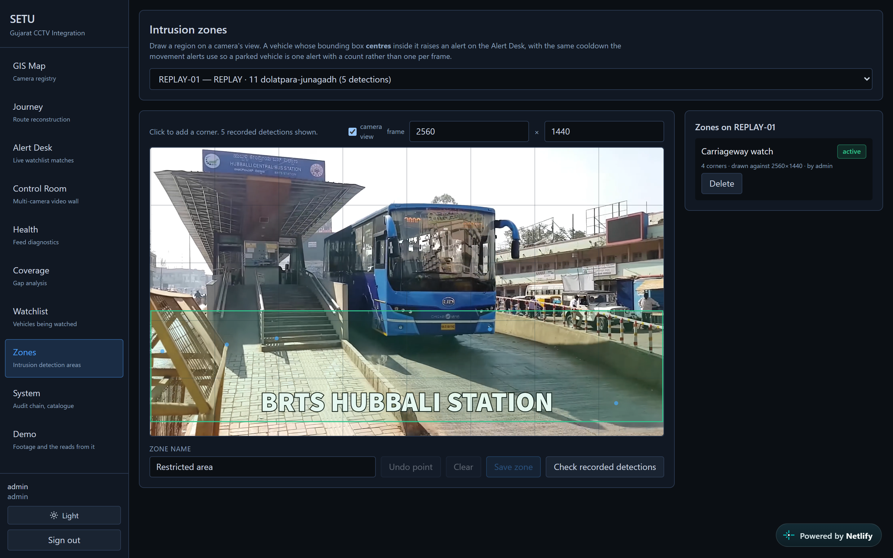
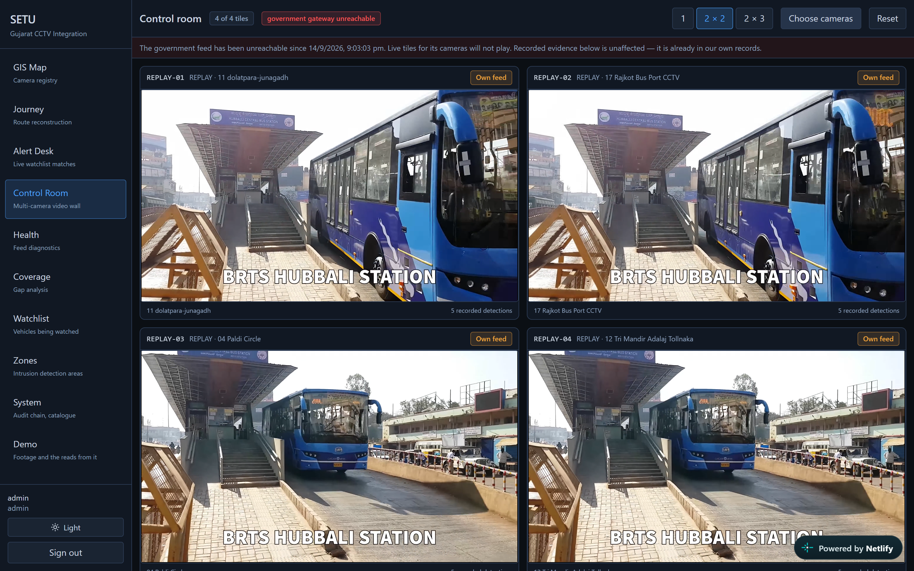
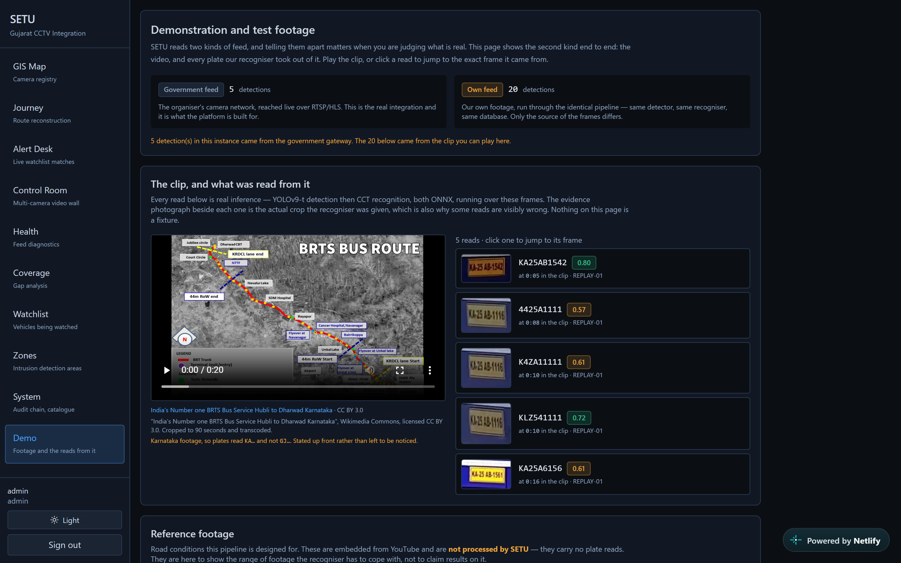
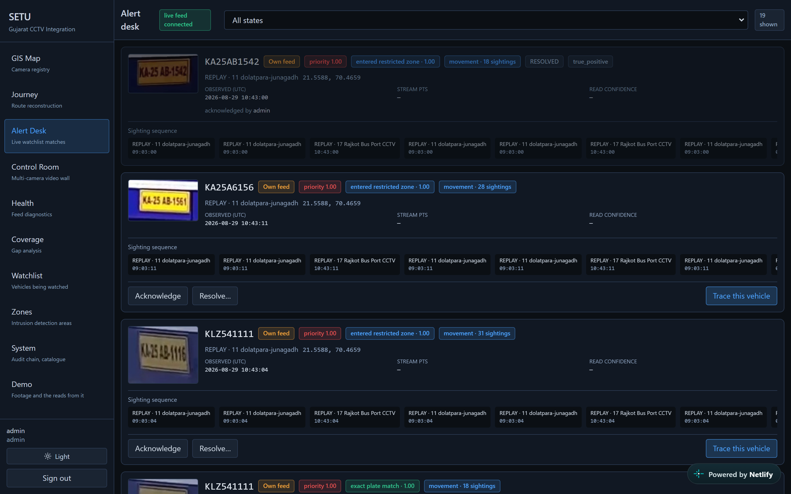
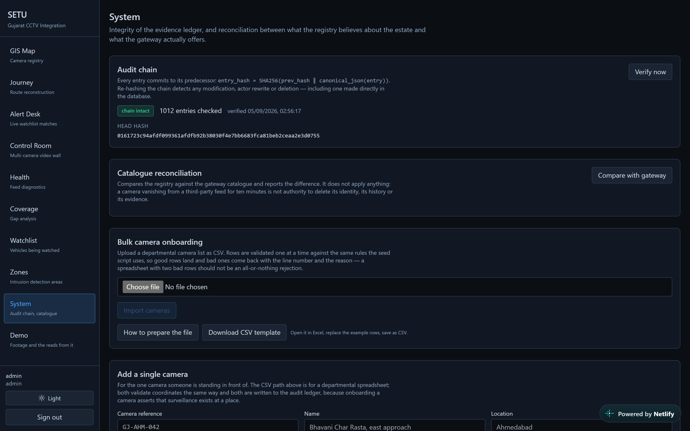
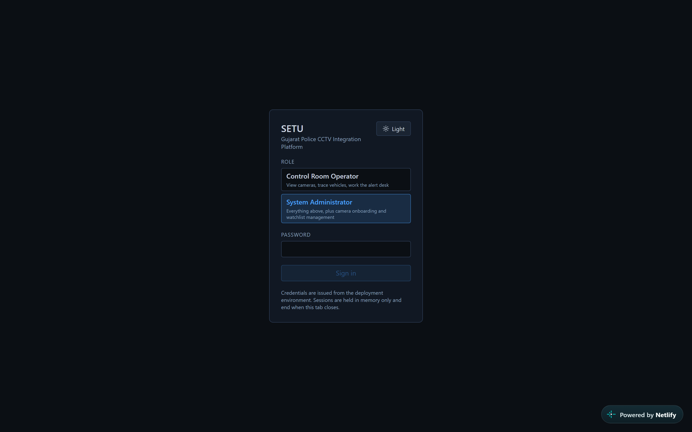

# Project SETU

Gujarat Police operate roughly 80,000 CCTV cameras across 26 government departments
that cannot interoperate — different vendors, VMS platforms, storage and retention.
SETU is one web platform that federates them, so that **a judge can supply a vehicle
registration number and see that vehicle's route across the camera network on a map,
with timestamps, evidence photographs, and honest gaps where we did not see it.**
Separately, a watchlisted vehicle appearing on a live feed raises an alert within
seconds.

Built for the Gujarat Police Innovation Challenge 2026 (CCTV Integration Hackathon),
Category 1.

**Live:** [setu-gujarat.netlify.app](https://setu-gujarat.netlify.app) · API and interactive
docs at [setu-api-ai7z.onrender.com/docs](https://setu-api-ai7z.onrender.com/docs) ·
credentials are supplied with the submission. The console runs on a free tier that
sleeps when idle, so the first page load can take up to a minute.


*One registration number in, a route out: four cameras, 413 km, every hop timestamped
and carrying the plate crop it came from — and the two lines that matter most, printed
without being asked. Eight cameras excluded for having no coordinate on record, and
twenty-four that saw nothing declared as a coverage gap rather than an absence of the
vehicle.*

---

## Walk it yourself, in five minutes

Sign in at [setu-gujarat.netlify.app](https://setu-gujarat.netlify.app). Each step below
names what you should see, so nothing here has to be taken on trust.

| | Do this | You should see |
|---|---|---|
| **1** | Open **GIS Map** | The camera registry. A camera we can place only to a district is drawn as a **circle**, not a pin |
| **2** | **Journey** → `KA25AB1542`, dates covering August–September, any purpose, *Trace vehicle* | **4 hops, 413 km.** Read the two lines the page prints unasked: cameras excluded for having no coordinate, and cameras that saw nothing, labelled *a coverage gap, not an absence of the vehicle* |
| **3** | Press **Export signed evidence (PDF)** | The same reconstruction re-run server-side, signed, with the evidence crops embedded |
| **4** | **Alert Desk** | Watchlist matches and zone intrusions together — each with the crop, camera, time, confidence, and the listing that authorised it |
| **5** | **Zones** → select `REPLAY-01` | A polygon drawn on that camera's own view, with real past detections plotted on it |
| **6** | **System** → verify the audit chain | Your search from step 2 is in it, with the purpose you typed |
| **7** | Sign out, sign in as **operator**, try to add a watchlist entry | `403 adding a watchlist entry requires admin`. The API refuses it; the interface is not merely hiding a button |

Step 7 is the one worth doing. Authorising surveillance and conducting it are different
responsibilities, and this is where you can check that the separation is real.

> The console runs on a free tier that sleeps when idle, so the first page load can take
> up to a minute. Every request after that is normal speed.

---

## Solution model

**Hybrid**: Model 1 (centralised registry and GIS — mandatory) + Model 3 (federation
middleware — the structural core) + Model 2 (unified viewing — the operator surface),
with Model 4 documented as a migration path rather than a starting position.

Gujarat does not have a camera problem; it has 26 camera *ecosystems* with different
ages, owners and AMC periods. Any architecture that begins by replacing them is
unaffordable. Any architecture that connects directly to each creates an N-to-N
integration burden that grows with every AMC renewal. So Model 1 is not a spreadsheet
with a map — it is the control plane. Every camera carries one identity record: who
owns it, where it is, what it can do, and what the platform is currently allowed to
pull from it. Model 3's adapter layer is how that control plane reaches heterogeneous
reality: one interface, many implementations. Model 4's analytics and evidence
requirements are adopted; its assumption that all video must flow to one datacentre is
deliberately dropped. **Video stays at the edge; metadata flows to the centre.**

---

## Measured results

Everything below was produced by running the system. Nothing is estimated.

### Feed-contract compliance — 8/8

The organiser's §2.4 pre-submission checklist, verified empirically against the live
gateway, not asserted from code comments. `reports/evidence/preflight-*.json`.

### Performance

| Measurement | Result | HLD claim | Verdict |
|---|---:|---|---|
| Journey query, 12-hour window | median **38 ms**, p95 **60 ms** | under 3 s | meets |
| Decode to alert | median **14 ms**, p95 **1486 ms** | under 2 s | meets |
| Frames reaching the plate detector | **13.7%** | — | 86.3% filtered out before the expensive stage |

Two independent reductions produce that 86.3%, and they are **not** equally
responsible. PTS-based sampling to a 5 fps analytic rate removes 83.2% on its own; the
motion gate removes a further 32.7% of what survives. Earlier notes attributed the whole
reduction to the motion gate — re-measuring on 2026-08-28 separated the two and that
attribution was wrong. Enabling the gate changes the pipeline's output not at all (22
plate regions, 2 valid registrations, with and without), so it is a free saving rather
than a quality trade. Full table and reproduction commands:
[`docs/EDGE_OPTIMISATION.md`](docs/EDGE_OPTIMISATION.md).

### Throughput and the 80,000-camera question

| Case | Resolution | Decode | Cameras/worker | Workers for 80,000 |
|---|---|---:|---:|---:|
| Full resolution, as published | 2560×1440 | 24.3 fps | 0.81 | ~98,500 |
| Sub-stream, as ANPR ingests | 704×396 | 114.4 fps | 3.82 | **~21,000** |

Both figures are **CPU-only, no GPU**. Read them together with the accuracy caveat
below: the recogniser reads **nothing** at 704×396, so the 3.82 figure is throughput
at an unusable operating point. The defensible number is the full-resolution one —
**~98,500 CPU workers for a centralised design**, which is a stronger argument for
pushing analytics to the edge and moving metadata rather than video, not a weaker one.
Finding the lowest resolution that preserves plate legibility is the single most
valuable optimisation outstanding. See `reports/evidence/benchmarks-*.md` and
[`docs/HLD_RECONCILIATION.md`](docs/HLD_RECONCILIATION.md).

What it would take to point this at a real camera network — the adapter contract, what
does *not* change, the network realities, and what departments would have to supply — is
set out in [`docs/REAL_TIME_INTEGRATION.md`](docs/REAL_TIME_INTEGRATION.md).

### The government feed — the scored test case

The estate was swept twice with the same pipeline, running against `GatewaySource`
instead of a file. `reports/evidence/gateway-output-report-2026-08-27.md`.

| | Result |
|---|---:|
| Cameras catalogued | 30 |
| Cameras that produced frames | **25** |
| Cameras that produced none | 5 — two return HTTP 500, three time out |
| Frames decoded | 9,158 |
| Plate regions detected | 30 |
| Grammar-valid registrations | **4** |

**Nine thousand frames across twenty-five live cameras contained three plates a human
can read.** That is the single most important finding about this estate, and it is a
property of the feed rather than of the pipeline: at the resolution and framing these
cameras publish, a number plate does not occupy enough pixels to survive. The evidence
crops are committed; the illegible ones are illegible to a reviewer too.

**The estate moved on 2026-09-01** to a new host, behind an access code, with the
media plane split across two machines: a CDN serves the catalogue and HLS, while RTSP
and WebRTC come from a bare public IP because a CDN cannot proxy either. It was swept
again on **2026-09-02**, over RTSP, writing to the deployed database:

| | Result |
|---|---:|
| Cameras catalogued | 30 |
| Cameras that produced frames | **25** |
| Cameras that produced none | 5 — `no frames within budget` |
| Frames decoded | 3,938 |
| Plate regions detected | 18 |
| Records published | 4 |
| Grammar-valid registrations | **1** — `GJ09BM3641` |

One published record **is** a vehicle: `cam22` returned `GJ09BM3641` at confidence
0.757 on 3 September, and the enlarged crop is unmistakably a real Gujarat plate. It is
the first grammar-valid registration this estate has produced, and it flowed the whole
way through untouched — persisted, matched against that camera's intrusion zone, and
raised as an alert on the Alert Desk. The digit after `GJ` is legible as either `8` or
`9` and we do not claim to have settled which.

The other three are not registrations, and every crop was opened and looked at rather
than trusted from its filename. `cam03` is the caption the camera burns into its own
frame — `O.N.G.C. Office BS-103_B1`, read as `0ACCO`. `cam02` is a dark building facade
with no plate in it. `cam22` also produced `AZ9072`, which *is* a genuine yellow
commercial plate but a two-line one, and our recogniser reads a single line, so no
complete registration can come from it however sharp the image. All three are left in
the database: deleting the outputs that embarrass you is how an error rate stops meaning
anything.

Otherwise a new host and a new estate produced the same answer as the old one:
twenty-two live cameras and two thousand frames contain no plate a recogniser can read.

One real plate was seen, and it is worth stating because it cuts the other way: an
earlier pass on cam07 read `GJ3ZAG0344` from a genuine Gujarat plate whose crop reads
`GJ32AG0344` — a real detection, one character wrong. The estate does occasionally
present a legible plate. It does not do so reliably enough to trace a vehicle.

**The estate is genuinely heterogeneous, and the registry now proves it.** The
catalogue publishes no codec, resolution or frame rate — it returns 1,373 bytes and two
keys, `id` and `name` — so every property below was measured from the decoded stream and
written back to the registry:

| Property | Observed across 30 government cameras |
|---|---|
| Codec | **24 × H.264, 6 × H.265** |
| Resolution | 2560×1440, 1920×1080, 1280×960, 1280×720, 960×576 |
| Measured frame rate | 15.0 – 30.1 fps, per camera |
| Status after probing | 26 ACTIVE, 4 UNREACHABLE |

The organiser's checklist asks that a pipeline handle mixed H.264/H.265 and mixed
resolutions. That is now a property of the registry a reviewer can read, rather than a
claim in a document.

Declared frame rate remains unreliable, as §2.2 warns: **5 of the 8 cameras that both
declare a rate and delivered frames diverge by more than 5%** — camera 15 declares
12.5 fps and delivers 5.38. Another 17 delivered frames while declaring nothing at all.

### ANPR accuracy — measured

Every evidence crop is annotated by eye and scored with
`backend/scripts/ground_truth.py`. The annotation sheet is committed as
`data/seed/anpr_ground_truth.csv`, so the numbers are checkable by someone who does
not trust us.

| Measure | First measurement | After the fixes below |
|---|---:|---:|
| Plate-level precision | 0.0% | **29.6%** |
| Plate-level recall | 0.0% | **29.6%** |
| Character error rate | 39.8% | **26.9%** |
| Registrations read exactly right | 0 | **8** |
| Reads asserted on a crop no human can read | 21 | **0** |

On the government feed specifically, **4 of 7 evidence crops from camera 7 are now
read exactly right** — `GJ32AA3900`, `GJ32AG1111`, `GJ32AG3028`, `GJ32K2007`.

The first measurement was 0%: not one registration read correctly, anywhere. Three
defects caused it, and each was found by measuring rather than by reading code.

**1. The recogniser could not physically emit a full Indian plate.** A model's
`max_plate_slots` is its number of classification heads. The configured
`cct-s-v1-global-model` has **nine**. Indian registrations run to **ten** characters
(`XX00XX0000`). Every full-length plate was wrong before inference began, and the
tell was in plain sight once looked for: every single read was exactly nine
characters long. Now on the 10-slot `cct-s-v2-global-model`, guarded by a test.

**2. Multi-frame fusion never ran.** Detections were associated across frames by
bounding-box overlap alone, at a 0.25 IoU threshold. Sampling is 5 analytic fps, so
consecutive looks at one vehicle are 200 ms apart — by which time a plate has moved
further than its own width and the boxes overlap by *nothing*. 22 detections became
14 tracks, 13 of them one frame long. Fusion was dead code, and every plate was
decided by a single noisy read. Association is now motion-tolerant, bounded by
distance, scale and elapsed time so it cannot merge two vehicles.

**3. Fusion voted misaligned characters against each other.** Reads of differing
length were always right-aligned, which is correct when OCR drops a *leading*
character and wrong when it drops a trailing one — and when wrong it shifted every
position by one. Three near-correct reads of `KA25AB1542` fused to `KA25A1154`,
*worse than the best single read*, because the disagreement was manufactured by the
alignment rather than present in the evidence. Alignment is now chosen per read.

A fourth change is a policy rather than a fix: **a read below 0.5 fused confidence is
not published at all.** Of the crops a reviewer found illegible, every pipeline read
scored 0.46 or below, while both exactly-correct reads scored 0.79 and 0.94. Cutting
there removed all 21 false assertions and kept every correct read. Reporting a wrong
registration to an investigator is worse than reporting nothing, and a wrong
registration carrying a high confidence is worse still, because it will be believed.

> **What this still does not say.** 29.6% is measured on 27 annotated rows from two
> sources, neither ideal: a third-party Karnataka clip shot from a moving bus, and a
> government estate where three crops in a 9,000-frame sweep contain a legible plate.
> Most remaining errors are one vehicle in that clip. Resolution still dominates —
> the same pipeline reads 8 plates at 2560×1440, 2 at 1280×720 and **none** at
> 704×396 — which is why the scaling argument is for processing at the edge, where
> full resolution still exists.

**Defence in depth, and its limit.** The detector fires on burnt-in camera text —
`Suvidhapark P3 RLVD`, `GRAM PANCHAYAT 1`, a lorry's painted name board. The Indian
plate grammar rejects almost all of it. But one OSD banner reading `Camera 01` was
read as `CO1EIT011`, which **is** a legal layout and passed. The grammar is a strong
filter, not a complete one, and the confidence floor is what now stops that class.

---

## How it is used

Three jobs, in the order a police force actually meets them. Every screenshot below was
captured against the live deployment with the data that is in it — none is a mock-up.

### Job 1 — Trace a vehicle

*An FIR is filed. The registration is known. Where has the vehicle been?*

**Watchlist** → the vehicle is entered with the **authority** that listed it, the **case
reference**, and an **expiry**. Expiry is a required field with no default: an entry
without one is a permanent record about a citizen, created by forgetting. This screen is
where the authorisation to look for a vehicle is written down, before any looking happens.

**Alert Desk** → the moment any camera reads that plate, an alert appears carrying the
crop, the camera, the time, the read confidence, and the watchlist entry it matched.
An operator acknowledges or resolves it.

**Journey** → registration, time window, and a **purpose**, which is written to the
tamper-evident ledger *before* the search runs. The result is the route: which camera,
at what time, how far apart — and where the gaps were.

**Export** → a signed PDF with the evidence photographs, for the case file.


Two things in that screenshot are deliberate and worth naming, because they are what
separates a route a court can use from one it cannot. *"8 cameras excluded from this
search: no coordinate on record"* — a camera we cannot place is declared, not quietly
dropped. And *"24 cameras on this route produced no detection — a coverage gap, not an
absence of the vehicle"* — the dashed line is an admission, not a claim. **Only cameras
that actually saw the vehicle become hops.** The line between them is never inferred.

### Job 2 — Watch a place

*A godown, a toll plaza, a gate. Nothing should enter it after dark.*

**Zones** → draw a region on that camera's view. The camera's own picture sits behind the
drawing surface, and every place a vehicle has previously been detected is plotted on it,
so the region is placed against evidence rather than guesswork. A vehicle whose bounding
box **centres** inside the region raises an alert.



*The green polygon is drawn over the carriageway of that camera's own view, and the blue
dots are places a vehicle has actually been detected — so the region is placed against
evidence rather than a guess. The frame size beside it, 2560×1440, is read from what the
pipeline measured on this camera rather than typed, because a wrong reference size does
not fail loudly: it silently places every corner against the wrong frame.*

**This is the analytic that works on the government estate today**, because it needs a
vehicle box rather than a readable plate.

**Control Room** → up to six cameras at once, each labelled by whose feed it is.



*Four government cameras playing at once — Chiman bhai Bridge and Janpath at night,
with the cameras' own burnt-in timestamps visible in frame. Each tile is labelled by
whose feed it is, and carries the count of detections already recorded against that
camera.*

### Job 3 — Plan and account for the estate

*A senior officer asking what exists, what works, and who did what.*

**GIS Map** — every camera, its department, its status. A camera that can only be placed
to a district is drawn as a **circle**, not a pin, because a false pin produces an
authoritative-looking route that is wrong.

**Coverage** — which districts are thin, which cameras have no position, grouped by the
remedy rather than by severity: dropping a pin and procuring a camera do not belong on
one scale.

**Health** — declared frame rate against measured, reconnects, transport in use. One
click produces the organiser's §2.5 fault-report payload.

**System** — the audit ledger, verifiable on demand. Who searched for what, when, and
under what stated purpose. It is hash-chained, so an entry cannot be altered after the
fact without the chain failing.

That ledger is not decoration. While capturing the screenshots on this page, a stray zone
appeared on `cam02` that nobody had deliberately created. The chain answered the question
exactly: `seq=862 CREATE_ZONE`, `seq=863 DELETE_ZONE` eight seconds later, `seq=899
CREATE_ZONE` again — an automated capture script whose click had landed on the drawing
surface. The zone was removed through the audited endpoint. A system that can tell you
that about itself is the point of the feature.

### Who can do what

**Control Room Operator** — view cameras, trace vehicles, work the alert desk.
**System Administrator** — all of that, plus camera onboarding, watchlist and zone
management.

The split is not cosmetic. Authorising surveillance and conducting it are different
responsibilities, and the API enforces it rather than the UI hiding buttons: an operator
sending a valid watchlist create is answered `403 adding a watchlist entry requires admin`.

---

## The console

Ten screens, all on real API data. No mocked components — a screen without a real
backing endpoint does not ship, and no endpoint ships without a screen.

### GIS Map — camera registry


Coordinate provenance is rendered, not hidden. A geocoded camera is a precise pin; one
we can place only to a district is a translucent circle at its real confidence radius;
cameras with no coordinate appear in a side panel as *coordinate missing* with a
pin-drop control. A false precise pin would produce an authoritative-looking route
that is wrong.

### Journey — the scored capability


Numbered hops on a route polyline, the evidence crop for every hop, provenance badges
naming the exact characters corrected, per-hop coordinate confidence, an implied-speed
column so a reviewer can check the physics independently, and dashed segments labelled
*no detection at &lt;camera&gt; — coverage gap*. Signed PDF export from the same screen.

### Alert Desk


Live WebSocket feed. Every card carries the evidence crop, three timestamps
(`observed_at_utc`, stream PTS, ingest), match type and score, corrections listed
explicitly, and the watchlist authority and case reference. Confusion-aware fuzzy
matching surfaces vehicles an exact-match system misses entirely.

### Control Room — multi-camera video wall


Up to six tiles, chosen from the registry, each labelled **Government feed** or
**Own feed** so nobody has to remember which is which. Cameras with recorded
detections are listed first: a registry position with nothing behind it has nothing
to show, and sorting by that saves an operator from picking an empty tile.

Government tiles play through an authenticated proxy rather than directly. The
estate serves HLS from a host that requires a session cookie and refuses anything
that does not look like a browser, and a browser cannot be handed either — so the
API holds the session and re-signs each playlist and segment as a short-lived URL.
When a tile cannot play, it says which camera, what the upstream returned, and that
the registry entry and its recorded detections are unaffected. A blank rectangle
would leave an operator unable to tell a dead camera from a dead console.

### Zones — intrusion detection areas


A polygon drawn over one camera's view, in that camera's own frame pixels. Real
detection centroids from that camera are plotted on the drawing surface, so a zone
is placed against where vehicles have actually been seen rather than against a
guess, and a pending polygon previews how many recorded detections it would have
caught before it is saved. **Check recorded detections** then re-runs the
classifiers over stored history, which is what makes a newly drawn zone testable
without waiting for traffic.

A detection alerts when its vehicle box *centres* inside the polygon — see
why overlap is deliberately not enough: a box grazing a boundary is a vehicle
passing, and alerting on that is how a desk fills with events an operator learns to
dismiss. Zones need only a vehicle
box, not a readable plate, which is why they work on this estate today when journey
and watchlist do not.

### Demo — the own-feed clip, frame-aligned


The clip that the accuracy figures are scored against, played beside the reads it
produced, aligned by presentation timestamp so a reviewer can watch a plate arrive
and see what the pipeline made of it. Three unprocessed YouTube videos sit below
it, labelled as such: they are there so a judge can try footage we did not choose,
not to imply we processed them.

### Coverage — gap analysis


Model 1's own requirement. Gaps are separated by remedy because the cost of each
differs by orders of magnitude: a missing coordinate is a pin drop, an approximate one
needs a survey, a degraded camera needs maintenance on capital already spent, and
uncovered ground needs procurement. Investigation-derived gaps — positions real plate
queries kept needing where nothing was seen — are the evidence-backed case for where
the next camera should go.

### Health


Declared versus measured frame rate with drift, transport in use, reconnect counts,
and a false-positive rate derived from operator dispositions. One click generates the
organiser's §2.5 fault-report payload verbatim.

### Watchlist — what the platform is authorised to look for


Every alert begins here, so this is where the authorisation for one is visible: which
vehicle, listed by whom, under which case reference, and **until when**. Expiry is a
required field with no default — an entry without one is a permanent record about a
citizen created by omission, so the API refuses it and the form defaults to 30 days.
The table shows the remaining life of every entry, and adding one is written to the
audit ledger with the actor before it takes effect. Reading the list is open to any
operator; extending it requires admin.

### System — integrity and reconciliation


Audit-chain verification, run on demand rather than only through Swagger:
tamper-evidence nobody can check is a claim, not a control. Alongside it, catalogue
reconciliation diffs the registry against the gateway and *reports* — a camera
vanishing from a third-party feed for ten minutes is not authority to delete its
identity, its history or its evidence.

### Login


Two roles — **Control Room Operator** and **System Administrator** — with passwords
issued from the deployment environment. No self-registration, no default credential,
no consumer identity provider: `POST /auth/login` returns 503 rather than falling back
to a known password if none is configured.

The JWT is held in `sessionStorage`, never in `localStorage`. The distinction is the
one that matters: both are readable by any script on the origin, but the window
`sessionStorage` opens closes when the tab does, so a stolen session cannot outlive it.
Memory alone was the first answer and was too strict to be usable — refreshing the page
signed you out, which is a bug an operator experiences long before an attacker does.
The token is the only thing stored; role and username are read back out of its payload,
because two copies of one fact can disagree and the server acts on the token.

**Google sign-in is deliberately absent.** For a closed law-enforcement system,
unscoped consumer OAuth would let anyone with a Gmail account reach the authenticated
boundary — a larger attack surface serving no real user. Department-federated login
via OIDC (Keycloak, already provisioned behind a `planned` compose profile) is the
production path; the department scoping it would feed is already built and enforced in
Postgres row-level security. See `docs/SETU_High_Level_Design.md` §8.4.

---

## Quickstart

```bash
make venv
cp .env.example .env          # then generate real secrets — see docs/DEMO_RUNBOOK.md
make demo                     # stack up, migrate, seed, ingest, match, build console
make api                      # terminal 1 → http://127.0.0.1:8090/docs
make frontend-dev             # terminal 2 → http://localhost:5173
```

`make demo` works end to end **with the government gateway unreachable**, which is the
state to plan for. Full demonstration script, credentials and fallbacks in
[`docs/DEMO_RUNBOOK.md`](docs/DEMO_RUNBOOK.md).

### Production containers

```bash
docker compose -f docker-compose.prod.yml --env-file .env.prod up -d --build
# console http://localhost:8080
```

Three containers — Postgres, the API, and nginx serving the console. Verified from a
clean state against ten checks including evidence photos rendering, the WebSocket
connecting, row-level security actually binding in the deployed database, and the
watchlist being populated with a bounded expiry on every entry.

Click-by-click deployment, for Railway alone and for Railway + Netlify:
[`docs/DEPLOY_STEP_BY_STEP.md`](docs/DEPLOY_STEP_BY_STEP.md). Every environment
variable, what breaks without it, and why the startup order is what it is:
[`docs/DEPLOYMENT.md`](docs/DEPLOYMENT.md).

---

## Security posture

| Control | Where |
|---|---|
| Three-level tenant isolation | Gateway policy, scoped accessors, **and Postgres RLS** — 9 tests issue raw SQL that bypasses the application entirely |
| Unprivileged database role | `setu_app` is NOSUPERUSER/NOBYPASSRLS with table-scoped grants; a superuser would ignore every RLS policy |
| Append-only audit ledger | `entry_hash = SHA256(prev_hash ‖ canonical_json(entry))`. The application holds no UPDATE on it |
| SSRF defence | Scheme and port allowlists, DNS checks, connect-time re-verification against rebinding, redirects refused, size cap — 44 adversarial tests |
| `alg=none` rejection | Explicitly, before verification; proven with a forged token |
| Credential redaction | Formatter-level, so a credential cannot reach a log sink even if interpolated |
| Signed evidence | Ed25519 detached signature over a canonical manifest; verifiable without SETU |
| Mandatory purpose | Written to the audit ledger *before* a journey query executes |
| Watchlist expiry | `NOT NULL` — an entry without one becomes a permanent shadow record |
| Browser session | JWT in `sessionStorage`, so a stolen session dies with the tab; a 401 clears the stored copy as well as the in-memory one |
| Login rate limit | Sliding window on the one unauthenticated endpoint that burns CPU by design — unbounded bcrypt is a denial-of-service primitive |

No face recognition. It stays unbuilt until all four governance controls fit; an
ungoverned biometric feature is worse than none in front of this jury.

---

## Repository layout

```
backend/            Python services, migrations, scripts, tests
  services/
    api/            FastAPI, routers, auth, tenancy, hash-chained audit, evidence export
    analytics/      ANPR pipeline, plate grammar, watchlist matcher, persistence
    ingest/         CameraSource protocol, FileSource, GatewaySource
    registry/       SQLAlchemy models, camera lifecycle, seed loader
    common/         transport, stream client, SSRF guard, redaction, paths
  migrations/       Alembic — reversibility is tested, not assumed
  scripts/          preflight, probe, geocode, ANPR, demo seed, ground truth, benchmarks
  tests/            325 tests
frontend/           React 18 + TypeScript console (ten screens)
data/               seeds, own-feed footage, evidence crops
docs/               runbook, discovery record, ADRs, screenshots
reports/evidence/   dated, committed evidence records
```

See [`backend/README.md`](backend/README.md) and
[`frontend/README.md`](frontend/README.md) for per-tree detail, and
[`docs/DISCOVERY.md`](docs/DISCOVERY.md) for what the live gateway actually returned
as opposed to what the integration guide describes — twenty-two dated findings, each
with the measurement behind it, including the optimisations that were measured and
rejected.

---

---

## What a shift actually looks like

It is 2 a.m. and an FIR comes in for a stolen vehicle. Today that means logging into
five departmental systems, requesting footage from each, and correlating it by hand —
and by the time anyone has an answer the vehicle has left the district.

With SETU it is one screen. The registration goes on the watchlist with the authority
that listed it and the case it belongs to. The moment any camera in the federation reads
that plate, an alert reaches the desk with the photograph, the camera, the second it
happened and the listing that authorised the match. The officer types the registration
into Journey, states why they are looking, and gets the route — where it was seen, when,
how far apart, and where the network could not see it at all. One button turns that into
a signed PDF for the case file.

Minutes, not days. And every step of it is in a ledger that says who asked, when, and
under what authority.

## Why we think this stands apart

**Because the numbers in this document are measurements, not claims.** Every figure
here was read from the running system, and the ones that are unflattering are here too.
ANPR reads 29.6%. The government estate yielded one registration across 3,938 frames.
Four optimisations — detector tiling, crop upscaling, six preprocessing variants,
full-resolution inference — were built, measured, and thrown away because the data said
they made things worse. That work is in `docs/DISCOVERY.md` with the numbers that killed
it, because a team that only reports what worked has not told you how it decides.

**Because the hard parts are the ones nobody demos.** Row-level security in the database
rather than the UI, so a bug in the application cannot route around it. A hash-chained
ledger that is verifiable by any authenticated actor, not only by the role that can alter
records. Evidence signed with Ed25519 so a document can be checked without us. A purpose
written before a search runs, not after. None of it photographs well. All of it is what
separates a surveillance platform a state can defend from one it merely owns.

**Because it tells the truth when things break.** When the upstream estate goes dark, the
console names the minute contact was lost and says that recorded evidence is unaffected —
so an operator knows whether the fault is theirs. When a route crosses cameras that saw
nothing, the map draws a dashed line labelled *a coverage gap, not an absence of the
vehicle*. When a camera's position is uncertain, it is a circle, not a pin. A system that
overstates what it knows is worse than one that knows less, because a court will find the
overstatement first.

And once, the ledger caught us. A zone appeared on a camera that nobody had deliberately
created, and the chain answered exactly: created at entry 862, deleted eight seconds
later, created again at 899 — an automated screenshot script whose click had landed on
the drawing surface. A tamper-evident record that has never told you anything you did not
already know is a claim. Ours has now earned the name.

## What it is built to become

Nothing here assumes this estate. The registry is the control plane, the adapter layer is
how it reaches heterogeneous reality, and both were written so that a new vendor is a new
implementation of one interface rather than a new integration project. Thirty cameras or
eighty thousand, the shape does not change — only how many machines run it, and where
they sit. `docs/EDGE_OPTIMISATION.md` argues, from the resolution effect we measured
rather than from a diagram, why the inference belongs near the camera.

The plates will come. Cameras get replaced on their own schedule, and the day one of them
publishes a legible plate at two positions, route reconstruction across the government
estate starts working with nothing changed in this repository. The pipeline is already
waiting for it.

---

## Thank you

To **Gujarat Police** and the Home Department, for opening a real estate to students and
letting us fail against it in public. Almost everything worth knowing in this repository
came from something that did not work on the first attempt — a recogniser that could not
emit a ten-character plate, a fusion step that voted misaligned characters against each
other, a health probe that called a slow estate a dead one, four optimisations that had
to be measured before they could be rejected. None of that could have been learned
against a tidy dataset. It needed a live feed that answers differently on a Tuesday than
it did on a Monday, and you gave us one.

Thank you also for the constraint that shaped this submission most: cameras that publish
below the resolution ANPR needs. It would have been easier to be handed footage that made
us look good. What we were handed instead forced a decision on every screen about whether
to state what we actually knew or to imply more — and that decision is the reason this
platform declares its gaps, draws a circle where it cannot justify a pin, and records why
someone looked before it shows them anything.

To the other teams: we hope you found your own version of that problem, and we would
rather read your honest numbers than beat your optimistic ones.

**May the best team win.**

— Team SETU
